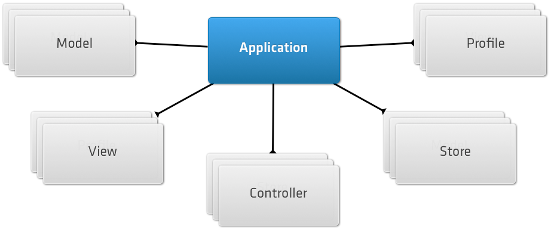

#Sencha Touch 2 : HTML5 mobile app framework

Sencha Touch enables you to quickly and easily create HTML5-based apps
that work on mobile devices, and produce a native-app-like experience
inside a browser or in a hybrid shell.

##Supported Platforms :

1.  Android
2.  IOS
3.  Windows Phone
4.  Microsoft Surface & RT
5.  Blackberry

##Prerequisites :

1.  Apache web server
2.  Sencha CMD
    ([Download](http://www.sencha.com/products/sencha-cmd/download))
3.  Sencha Touch 2
    ([Download](http://www.sencha.com/products/touch/download))
4.  Modern webkit browser (Chrome or safari)
5.  Apache Ant, Ruby, SASS, Compass
6.  Webstorm IDE (Optional)

##Installation :

###Ubuntu :

**Step 1**: Extract the `Sencha touch-2.x zip` file to your sencha projects
directory `“path/to/project_directory”`.

**Step 2**: Create [virtual
host](http://virtual-host-in-ubuntu.blogspot.in/2012/09/virtual-host-in-linux.html)
so that you should be able to navigate to the installed
`http://local.sencha-touch` directory from your browser and see the Sencha
Touch documentation.

**Step 3**: Extract the `SenchaCmd-3.1.x-linux.run.zip` file which will give
`SenchaCmd-3.1.x.x-linux.run` executable file.

**Step 4**: Open terminal and set executable permissions to sencha cmd .run
file

    $ sudo chmod a+x SenchaCmd-3.1.x.x-linux.run

**Step 5**: Execute `sencha cmd .run` file and follow instructions given by
sencha cmd installer.

##Creating First App :

The following command generates a new application with the namespace
`MyApp` to `"/path/to/myapp"`:

    # Make sure the current working directory is the Sencha Touch 2 directory
     $ cd /path/to/sencha-touch-2-directory

     $ sencha generate app MyApp /path/to/create/myapp

Create [virtual
host](http://virtual-host-in-ubuntu.blogspot.in/2012/09/virtual-host-in-linux.html)
(eg. http://local.myapp.com) so that you should be able to navigate to the
`MyApp` from your browser.

To try it out, simply point any WebKit-based browser to
`http://local.myapp.com`

##Basic Application Structure :

The generated application should have the following file structure:

    .sencha/                # Sencha-specific files (e.g. configuration)
        app/                # Application-specific content
            sencha.cfg      # Configuration file for Sencha Cmd
            plugin.xml      # Plugin for Sencha Cmd
        workspace/          # Workspace-specific content (see below)
            sencha.cfg      # Configuration file for Sencha Cmd
            plugin.xml      # Plugin for Sencha Cmd

    touch/                  # A copy of the Sencha Touch SDK
        cmd/                # Sencha Touch-specific content for Sencha Cmd
            sencha.cfg      # Configuration file for Sencha Cmd
            plugin.xml      # Plugin for Sencha Cmd
        src/                # The Sencha Touch source
        sencha-touch-*.js   # Pre-compiled and bootstrap files
        ...

    app                     # Your application's source code in MVC structure
        controller
        model
        profile
        store
        view
            Main.js         # The main view of the application

    resources
        css
            app.css         # The main stylesheet, compiled from app.scss

        sass
            app.scss        # The Sass file which compiles to app.css above,
                            # includes Sencha Touch 2 theme by default

        icons               # Application icons for all mobile devices
                            # When replacing these default images with your own,
                            # make sure the file name and the dimension stays exactly the same
            ...
        loading             # Application start-up screens for iOS devices
                            # Similarly to icons, make sure the file names and
                            # dimension stays the same
            ...
        images              # Put other images used by your application here

    index.html
    app.js                  # Contains application's initialization logics
    app.json                # Configuration for deployment
    packager.json           # Configuration for native packaging


###app.js ([view](https://gist.github.com/bhushan-webonise/5772487)):

`app.js`, the main entry point for the app.

The `launch` function is the entry point to the application. In the
default application, hide the application loading indicator, and create
an instance of our Main view and add it to the `Viewport`.

The `Viewport` is a [Card
layout](http://docs.sencha.com/touch/2.1.1/#!/api/Ext.layout.Card) to
which you can add application components. The default app adds the Main
view to the viewport so it becomes visible on the screen.

##Anatomy of an App :

An app is a collection of Models, Views, Controllers, Stores, and
Profiles, plus additional metadata for app-related entities, such as
application icons and launch screen images.



**Views**: are responsible for displaying data to your users and for
leveraging the built-in components in Sencha Touch.

**Models**: represent a type of data object in your app - for example an
e-commerce app might have models for User, Product, and Order.

**Controllers**: handle interaction with your application, by listening for
user interactions, such as taps and swipes, and taking action
accordingly.

**Stores**: are responsible for loading data into your app and for powering
components such as Lists and DataViews.

**Profiles**: enable you to easily customize your app's UI for tablets and
phones, while sharing as much code as possible.

The Application uses the defined models, views and controllers
configurations to automatically load these classes into your app. The
classes follow a simple file structure convention:

1.  models are expected to be in the app/model directory
2.  controllers are expected to be in the app/controller directory
3.  views are expected to be in the app/view directory

for example `app/model/User.js`, `app/controllers/Orders.js` and
`app/view/Main.js`.

###View :

From a user's point of view, your application is simply a collection of
views. Although much of the value of the app is in the Models and
Controllers, users directly interact with the Views.

The easiest way to create a view is to use
[Ext.create](http://docs.sencha.com/touch/2.1.1/#!/api/Ext-method-create)
with an existing Component. For example, if we wanted to create a simple
[Panel](http://docs.sencha.com/touch/2.2.1/#!/api/Ext.Panel) with some
HTML inside, we can use following code. ([gist
link](https://gist.github.com/bhushan-webonise/5772984))

```js
Ext.create('Ext.Panel', {
 html: 'Welcome to my app',
 fullscreen: true
});
```

Above example creates a
[Panel](http://docs.sencha.com/touch/2.2.1/#!/api/Ext.Panel) with some
html content and makes it fill the screen. The best practice is to
create a subclass with your specializations and then instantiate that
class. ([gist link](https://gist.github.com/bhushan-webonise/5773098))

```js
Ext.define('MyApp.view.Welcome', {
 extend: 'Ext.Panel',
 config: {
 html: 'Welcome to my app',
 fullscreen: true
 }
});

Ext.create('MyApp.view.Welcome');
```

You can create as many views as you want and organize them inside your
app/view directory. By specifying your application's Views inside your
app.js file, they are loaded automatically.

```js
Ext.application({
 name: 'MyApp',
 views: ['MyView'],

 launch: function() {
 Ext.create('MyApp.view.MyView');
 }
});
```

###Controller :

Controllers are responsible for responding to events that occur within
your app. Controller classes are the glue that binds Views and Models
together.

*  **Relation to Ext.app.Application** :

    Controllers exist within the context of an
    [Application](http://www.google.com/url?q=http%3A%2F%2Fdocs.sencha.com%2Ftouch%2F2.1.1%2F%23!%2Fapi%2FExt.app.Application&sa=D&sntz=1&usg=AFQjCNHWtPIaivpNvNMQ3g0IxTmP4xZXcQ).
    An Application usually consists of a number of Controllers, each of
    which handle a specific part of the app. For example, an Application
    that handles the orders for an online shopping site might have
    controllers for Orders, Customers, and Products.

    All Controllers used by an Application are specified in the
    Application's
    [Ext.app.Application.controllers](http://www.google.com/url?q=http%3A%2F%2Fdocs.sencha.com%2Ftouch%2F2.1.1%2F%23!%2Fapi%2FExt.app.Application-cfg-controllers&sa=D&sntz=1&usg=AFQjCNG7iZYNr6B8tL34fSSyMFLvVvp53A)
    config. The Application automatically instantiates each Controller and
    keeps references to each of them, so in most cases you do not need to
    instantiate Controllers directly. By convention each Controller is named
    after the entity (usually the Model) that it manages, usually in the
    plural.

    for example, if your app is called 'MyApp' and you have a Controller
    that manages Products, the convention is to create a
    `MyApp.controller.Products` class in the file `app/controller/Products.js`.

*  **Launching** :

    There are four main phases in your Application's launch process, two of
    which pertain to a Controller. First, each Controller is able to define
    an
    [init](http://docs.sencha.com/touch/2.1.1/#!/api/Ext.app.Controller-cfg-init)
    function, which is called before the Application launch function.
    Second, after the Application and Profile launch functions have been
    called, as the last phase of the process the Controller's launch
    function is called, as follows :

    1.  Controller\#init functions called
    2.  Profile\#launch function called
    3.  Application\#launch function called
    4.  Controller\#launch functions called
    
    Most of the time your Controller-specific launch logic should go into
    your Controller's launch function. Because the controller's launch
    function is called after the Application and Profile launch functions,
    your app's initial UI is expected to be in place at this point. If you
    need to do some Controller-specific processing before app launch, you
    can implement a Controller init function.

*  **Refs and Control** :

    The centerpiece of Controllers are the twin configurations
    [refs](http://www.google.com/url?q=http%3A%2F%2Fdocs.sencha.com%2Ftouch%2F2.1.1%2F%23!%2Fapi%2FExt.app.Controller-cfg-refs&sa=D&sntz=1&usg=AFQjCNGzzn3qX5Skv52yt5RF2MnxqxGz1g)
    and
    [control](http://www.google.com/url?q=http%3A%2F%2Fdocs.sencha.com%2Ftouch%2F2.1.1%2F%23!%2Fapi%2FExt.app.Controller-cfg-control&sa=D&sntz=1&usg=AFQjCNG4SOlJkmHbrY93RBUhbo-Wjioz7Q).
    These are used to gain references to Components inside your app and to
    take action on them, based on the events that they fire. In the
    following sections we first look at the
    [refs](http://docs.sencha.com/touch/2.1.1/#!/api/Ext.app.Controller-cfg-refs)
    config.

    *  **Ref** :

        Refs leverage the powerful
        [ComponentQuery](http://www.google.com/url?q=http%3A%2F%2Fdocs.sencha.com%2Ftouch%2F2.1.1%2F%23!%2Fapi%2FExt.ComponentQuery&sa=D&sntz=1&usg=AFQjCNHltWGe0QBfPRM1hiIR_rhQL3pSwQ)
        syntax to easily locate Components on your page. For each Controller we
        can define as many refs as required, for example in the following
        example we define a ref called 'nav' that finds on the page a Component
        with the 'mainNav' ID. We then use that refs in the subsequent
        addLogoutButton function, as shown in this sample: ([gist
        link](https://gist.github.com/bhushan-webonise/5780407))

```js
Ext.define('MyApp.controller.Main', {
 extend: 'Ext.app.Controller',

 config: {
 refs: {
 nav: '#mainNav'
 }
 },

 addLogoutButton: function() {
 this.getNav().add({
 text: 'Logout'
 });
 }
});
```

Usually, a ref is just a key/value pair - the key ('nav' in this case)
is the name of the reference that is to be generated, while the value
('#mainNav' in this case) is the
[ComponentQuery](http://www.google.com/url?q=http%3A%2F%2Fdocs.sencha.com%2Ftouch%2F2.1.1%2F%23!%2Fapi%2FExt.ComponentQuery&sa=D&sntz=1&usg=AFQjCNHltWGe0QBfPRM1hiIR_rhQL3pSwQ)
selector used to find the Component.

1.  Control :

The related config to
[refs](http://docs.sencha.com/touch/2.1.1/#!/api/Ext.app.Controller-cfg-refs)
is
[control](http://docs.sencha.com/touch/2.1.1/#!/api/Ext.app.Controller-cfg-control).
[Control](http://docs.sencha.com/touch/2.1.1/#!/api/Ext.app.Controller-cfg-control)
is the means by which your Controller listens to events fired by app
Components and reacts in some way. The Control config accepts both
ComponentQuery selectors and refs as its keys, and listener objects as
values, as shown in the following example: ([gist
link](https://gist.github.com/bhushan-webonise/5780413))

Ext.define('MyApp.controller.Main', {\
 extend: 'Ext.app.Controller',\
\
 config: {\
 control: {\
 loginButton: {\
 tap: 'doLogin'\
 },\
 'button[action=logout]': {\
 tap: 'doLogout'\
 }\
 },\
\
 refs: {\
 loginButton: 'button[action=login]'\
 }\
 },\
\
 doLogin: function() {\
 // called whenever the Login button is tapped\
 },\
\
 doLogout: function() {\
 // called whenever any Button with action=logout is tapped\
 }\
});

In each control declaration, you can listen to as many events as you
like, and mix and match ComponentQuery selectors and refs as the keys.

1.  Routes :

Controllers can directly specify which routes they are interested in.
This enables us to provide history support within our app, as well as
the ability to deeply link to any part of the application that we
provide a route for.

For example, let us assume that we have a Controller responsible for
logging in and viewing user profiles, and want to make those screens
accessible via urls. We could achieve this as follows ([gist
link](https://gist.github.com/bhushan-webonise/5780462))

Ext.define('MyApp.controller.Users', {\
 extend: 'Ext.app.Controller',\
\
 config: {\
 routes: {\
 'login': 'showLogin',\
 'user/:id': 'showUserById'\
 },\
\
 refs: {\
 main: '\#mainTabPanel'\
 }\
 },\
\
 // uses our 'main' ref above to add a loginpanel to our main TabPanel
(note that\
 // 'loginpanel' is a custom xtype created for this application)\
 showLogin: function() {\
 this.getMain().add({\
 xtype: 'loginpanel'\
 });\
 },\
\
 // Loads the User then adds a 'userprofile' view to the main TabPanel\
 showUserById: function(id) {\
 MyApp.model.User.load(id, {\
 scope: this,\
 success: function(user) {\
 this.getMain().add({\
 xtype: 'userprofile',\
 user: user\
 });\
 }\
 });\
 }\
});

The routes specified previously map the contents of the browser address
bar to a Controller function that is called when the route is matched.
The routes can be simple text like the login route, which matches
against http://myapp.com/\#login, or may contain wildcards such as the
'user/:id' route, which matches urls like http://myapp.com/\#user/123.
Whenever the address changes, the Controller automatically calls the
specified function.

1.  Before filter :

An additional functionality that Controllers provide within the context
of Routing is the ability to define filter functions that are run before
the function specified in the route. These are an excellent place to
authenticate or authorize users for specific actions, or to load classes
that are not yet on the page. For example, let us say we want to
authenticate a user before allowing him to edit a Product in an
e-commerce backend application ([gist
link](https://gist.github.com/bhushan-webonise/5780545))

Ext.define('MyApp.controller.Products', {\
 config: {\
 before: {\
 editProduct: 'authenticate'\
 },\
\
 routes: {\
 'product/edit/:id': 'editProduct'\
 }\
 },\
\
 // this is not directly because our before filter is called first\
 editProduct: function() {\
 //... performs the product editing logic\
 },\
\
 // this is run before editProduct\
 authenticate: function(action) {\
 MyApp.authenticate({\
 success: function() {\
 action.resume();\
 },\
 failure: function() {\

[](http://docs.sencha.com/touch/2.1.1/#!/api/Ext.Msg-method-alert)[Ext](http://docs.sencha.com/touch/2.1.1/#!/api/Ext.Msg-method-alert)[.](http://docs.sencha.com/touch/2.1.1/#!/api/Ext.Msg-method-alert)[Msg](http://docs.sencha.com/touch/2.1.1/#!/api/Ext.Msg-method-alert)[.](http://docs.sencha.com/touch/2.1.1/#!/api/Ext.Msg-method-alert)[alert](http://docs.sencha.com/touch/2.1.1/#!/api/Ext.Msg-method-alert)('Not
Logged In', "You can't do that, you're not logged in");\
 }\
 });\
 }\
});

The filter can perform any kind of processing it needs to, either
synchronously or asynchronously. In this case we are using our
application's authenticate function to verify that the user is currently
logged in. Since this could entail an AJAX request to check the user's
credentials on the server, it runs asynchronously - if the
authentication was successful, we continue the action by calling
action.resume(), if not we tell the user that he needs to log in first.

Model :

Model is only a set of fields and their data. In this guide we are going
to look at four of the principal parts of Model —
[Fields](http://www.google.com/url?q=http%3A%2F%2Fdocs.sencha.com%2Ftouch%2F2.1.1%2F%23!%2Fapi%2FExt.data.Field&sa=D&sntz=1&usg=AFQjCNErUpDIvRlWrbRtuShbY8UAYpOrVg),
[Proxies](http://www.google.com/url?q=http%3A%2F%2Fdocs.sencha.com%2Ftouch%2F2.1.1%2F%23!%2Fapi%2FExt.data.proxy.Proxy&sa=D&sntz=1&usg=AFQjCNGC-qOxUWjkRetmHhpwC6nOIq_JmQ),
[Associations](http://www.google.com/url?q=http%3A%2F%2Fdocs.sencha.com%2Ftouch%2F2.1.1%2F%23!%2Fapi%2FExt.data.association.Association&sa=D&sntz=1&usg=AFQjCNETcFMbm7wEFY55O8RGjJyJn_xpZA)
and
[Validations](http://www.google.com/url?q=http%3A%2F%2Fdocs.sencha.com%2Ftouch%2F2.1.1%2F%23!%2Fapi%2FExt.data.Validations&sa=D&sntz=1&usg=AFQjCNGQmPL2BFDw7g0boDFmBN8k_RA6Og).


1.  Fields :

The following code sample illustrates the creation of a model: ([gist
link](https://gist.github.com/bhushan-webonise/5794832))

Ext.define('User', {\
 extend: 'Ext.data.Model',\
 config: {\
 fields: [\
 { name: 'id', type: 'int' },\
 { name: 'name', type: 'string' }\
 ]\
 }\
});

1.  Associations :

Models can be linked together using the Associations API. Most
applications deal with many different models, and the models are almost
always related. A blog authoring application might have models for User,
Post, and Comment. Each user creates posts and each post receives
comments. We can express those relationships as shown in the following
example: ([gist link](https://gist.github.com/bhushan-webonise/5794856))

Ext.define('User', {\
 extend: 'Ext.data.Model',\
 config: {\
 fields: ['id', 'name'],\
 proxy: {\
 type: 'rest',\
 url : 'data/users',\
 reader: {\
 type: 'json',\
 root: 'users'\
 }\
 },\
\
 hasMany: 'Post' // shorthand for { model: 'Post', name: 'posts' }\
 }\
});\
\
Ext.define('Comment', {\
 extend: 'Ext.data.Model',\
\
 config: {\
 fields: ['id', 'post\_id', 'name', 'message'],\
 belongsTo: 'Post'\
 }\
});\
\
Ext.define('Post', {\
 extend: 'Ext.data.Model',\
\
 config: {\
 fields: ['id', 'user\_id', 'title', 'body'],\
\
 proxy: {\
 type: 'rest',\
 url : 'data/posts',\
 reader: {\
 type: 'json',\
 root: 'posts'\
 }\
 },\
 belongsTo: 'User',\
 hasMany: { model: 'Comment', name: 'comments' }\
 }\
});

As illustrated by this example, it is easy to express rich relationships
between different models in your application. Each model can have any
number of associations with other models, and your models can be defined
in any order. Once you have a model instance, you can easily traverse
the associated data. For example, to log all comments made on each post
for a given user, use code as in the following example: ([gist
link](https://gist.github.com/bhushan-webonise/5794862))

// Loads User with ID 1 and related posts and comments using User's
Proxy\
User.load(1, {\
 success: function(user) {\
 console.log("User: " + user.get('name'));\
\
 user.posts().each(function(post) {\
 console.log("Comments for post: " + post.get('title'));\
\
 post.comments().each(function(comment) {\
 console.log(comment.get('message'));\
 });\
 });\
 }\
});

Each of the hasMany associations we created above automatically adds a
new function to the Model. We declared that each User model hasMany
Posts, which added the user.posts() function used in the snippet above.
Calling user.posts() returns a Store configured with the Post model. In
turn, the Post model gets a comments() function because of the hasMany
Comments association that we have set up.

The belongsTo association also generates new methods on the model. The
following example shows how to use that functionality: ([gist
link](https://gist.github.com/bhushan-webonise/5794879))

// get the user reference from the post's belongsTo association\
post.getUser(function(user) {\
 console.log('Just got the user reference from the post: ' +
user.get('name'))\
});\
\
// try to change the post's user\
post.setUser(100, {\
 callback: function(product, operation) {\
 if (operation.wasSuccessful()) {\
 console.log('Post\\'s user was updated');\
 } else {\
 console.log('Post\\'s user could not be updated');\
 }\
 }\
});

1.  Validations :

Models have rich support for validating their data. To demonstrate this,
we build upon the previous example that illustrated associations. First,
let us add some validations to the User model: ([gist
link](https://gist.github.com/bhushan-webonise/5794887))

Ext.define('User', {\
 extend: 'Ext.data.Model',\
\
 config: {\
 fields: [\
 // ...\
 ],\
\
 validations: [\
 { type: 'presence', field: 'name' },\
 { type: 'length', field: 'name', min: 5 },\
 { type: 'format', field: 'age', matcher: /\\d+/ },\
 { type: 'inclusion', field: 'gender', list: ['male', 'female'] },\
 { type: 'exclusion', field: 'name', list: ['admin'] }\
 ],\
\
 proxy: [\
 // ...\
 ]\
 }\
});

Validations follow the same format as field definitions. In each case,
we specify a field and a type of validation. The validations in our
example are expecting the name field to be present and to be at least
five characters in length, the age field to be a number, the gender
field to be either "male" or "female", and the username to be anything
but "admin". Some validations take additional optional configuration -
for example the length validation can take min and max properties,
format can take a matcher, and so on. There are five validations built
into Sencha Touch, and adding custom rules is easy.

The following validation are built in:

1.  presence ensures that the field has a value. Zero counts as a valid
    value but empty strings do not.
2.  length ensures that a string has a length that is between a minimum
    and a maximum value. Both constraints are optional.
3.  format ensures that a string matches a regular expression format. In
    the example above we ensure that the age field is a number.
4.  inclusion ensures that a value is within a specific set of values
    (for example, we ensure that gender is either male or female).
5.  exclusion ensures that a value is none of the specific set of values
    (for example, we could be blacklisting usernames like 'admin').

Now that we have an understanding of the different validations, let us
use them to validate a User instance. In the following example, we
create a user instance and run the validations against it, noting any
failures: ([gist
link](https://gist.github.com/bhushan-webonise/5794903))

// now lets try to create a new user with as many validation errors as
we can\
var newUser = Ext.create('User', {\
 name: 'admin',\
 age: 'twenty-nine',\
 gender: 'not a valid gender'\
});\
\
// run some validation on the new user we just created\
var errors = newUser.validate();\
\
console.log('Is User valid?', errors.isValid()); // returns 'false' as
there were validation errors\
console.log('All Errors:', errors.items); // returns the array of all
errors found on this model instance\
\
console.log('Age Errors:', errors.getByField('age')); // returns the
errors for the age field

The key function here is validate(), which runs all of the configured
validations and returns an
[Errors](http://docs.sencha.com/touch/2.1.1/#/api/Ext.data.Errors)
object. This simple object is a collection of any errors that were
found, plus some convenience methods such as isValid(), which returns
true if there were no errors on any field, and getByField(), which
returns all errors for a given field.

Store :

Models are typically used with a Store, which is basically a collection
of model instances. Setting up a store and loading its data is done as
follows: ([gist link](https://gist.github.com/bhushan-webonise/5794931))

Ext.create('Ext.data.Store', {\
 model: 'User',\
 proxy: {\
 type: 'ajax',\
 url : 'users.json',\
 reader: 'json'\
 },\
 autoLoad: true\
});

In this example we configured the store to use an [Ajax
Proxy](http://www.google.com/url?q=http%3A%2F%2Fdocs.sencha.com%2Ftouch%2F2.1.1%2F%23!%2Fapi%2FExt.data.proxy.Ajax&sa=D&sntz=1&usg=AFQjCNFCwREbwEMP5444Gt2K9lHoC4tNog),
providing the name of the URL from which to load data and the
[Reader](http://www.google.com/url?q=http%3A%2F%2Fdocs.sencha.com%2Ftouch%2F2.1.1%2F%23!%2Fapi%2FExt.data.reader.Reader&sa=D&sntz=1&usg=AFQjCNENEpyHYzy8K1AYJsrtwC1GG58kOA)
used to decode the data. In this case the server is returning JSON, so
we have set up a [Json
Reader](http://www.google.com/url?q=http%3A%2F%2Fdocs.sencha.com%2Ftouch%2F2.1.1%2F%23!%2Fapi%2FExt.data.reader.Json&sa=D&sntz=1&usg=AFQjCNH6vKehnyYhcsIeGFcH1yRuk_TVkQ)
to read the response. The store automatically loads a set of User model
instances from the users.json URL. This URL should return a JSON string
similar to the following:

{\
 success: true,\
 users: [\
 { id: 1, name: 'Ed' },\
 { id: 2, name: 'Tommy' }\
 ]\
}

1.  ### Inline Data :

Stores can also load their data inline. Internally, a Store converts
each of the objects we pass in as
[data](http://www.google.com/url?q=http%3A%2F%2Fdocs.sencha.com%2Ftouch%2F2.1.1%2F%23!%2Fapi%2FExt.data.Store-cfg-data&sa=D&sntz=1&usg=AFQjCNFbPnyXJhuup1c5TvQwS74-qi0s9Q)
into
[Model](http://www.google.com/url?q=http%3A%2F%2Fdocs.sencha.com%2Ftouch%2F2.1.1%2F%23!%2Fapi%2FExt.data.Model&sa=D&sntz=1&usg=AFQjCNGnUMVAi1u-o99T8KcufViGvEAzgg)
instances: ([gist
link](https://gist.github.com/bhushan-webonise/5794935))

Ext.create('Ext.data.Store', {\
 model: 'User',\
 data: [\
 { firstName: 'Ed', lastName: 'Spencer' },\
 { firstName: 'Tommy', lastName: 'Maintz' },\
 { firstName: 'Aaron', lastName: 'Conran' },\
 { firstName: 'Jamie', lastName: 'Avins' }\
 ]\
});

1.  ### Sorting and Grouping :

Stores are able to perform sorting, filtering, and grouping locally, as
well as to support remote sorting, filtering, and grouping: ([gist
link](https://gist.github.com/bhushan-webonise/5794945))

Ext.create('Ext.data.Store', {\
 model: 'User',\
\
 sorters: ['name', 'id'],\
 filters: {\
 property: 'name',\
 value : 'Ed'\
 },\
 groupField: 'age',\
 groupDir: 'DESC'\
});

In the store we have created, the data is sorted first by name, then by
id; finally it is filtered to include only users with the name Ed, and
the data is grouped by age in descending order. Using the Store API, you
can change the sorting, filtering, and grouping at any time.

Proxy :

Proxies are used by stores to handle the loading and saving of model
data. There are two types of proxy: client and server. Examples of
client proxies include Memory for storing data in the browser's memory
and Local Storage which uses the HTML 5 local storage feature when
available. Server proxies handle the marshaling of data to a remote
server, and examples include Ajax, JsonP, and Rest.

Proxies can be defined directly on a model, as illustrated by the
following code sample: ([gist
link](https://gist.github.com/bhushan-webonise/5795589))

Ext.define('User', {\
 extend: 'Ext.data.Model',\
\
 config: {\
 fields: ['id', 'name', 'age', 'gender'],\
 proxy: {\
 type: 'rest',\
 url : '/data/users.json',\
 reader: {\
 type: 'json',\
 rootProperty: 'users'\
 }\
 }\
 }\
});\
\
// Uses the User Model's Proxy\
[Ext](http://docs.sencha.com/touch/2.1.1/#!/api/Ext-method-create)[.](http://docs.sencha.com/touch/2.1.1/#!/api/Ext-method-create)[create](http://docs.sencha.com/touch/2.1.1/#!/api/Ext-method-create)('[Ext.data.Store](http://docs.sencha.com/touch/2.1.1/#!/api/Ext.data.Store)',
{\
 model: 'User'\
});

This way of defining models helps in two ways. First, since it is likely
that every store that uses the User model needs to load its data in the
same way, we avoid having to duplicate the proxy definition for each
store. Second, we can load and save model data without a store: ([gist
link](https://gist.github.com/bhushan-webonise/5795614))

// Gives us a reference to the User class\
var User = Ext.ModelMgr.getModel('User');\
\
var ed = Ext.create('User', {\
 name: 'Ed Spencer',\
 age : 25\
});\
\
// We can save Ed directly without having to add him to a Store first
because we\
// configured a RestProxy this will automatically send a POST request to
the url /users\
ed.save({\
 success: function(ed) {\
 console.log("Saved Ed! His ID is "+ ed.getId());\
 }\
});\
\
// Load User 1 and do something with it (performs a GET request to
/users/1)\
User.load(1, {\
 success: function(user) {\
 console.log("Loaded user 1: " + user.get('name'));\
 }\
});

There are also proxies that take advantage of the new capabilities of
HTML5 -
[LocalStorage](http://www.google.com/url?q=http%3A%2F%2Fdocs.sencha.com%2Ftouch%2F2.1.1%2F%23%2Fapi%2FExt.data.proxy.LocalStorage&sa=D&sntz=1&usg=AFQjCNH3YNIsvn4lmYkLubMi279xDCPpQw)
and
[SessionStorage](http://www.google.com/url?q=http%3A%2F%2Fdocs.sencha.com%2Ftouch%2F2.1.1%2F%23%2Fapi%2FExt.data.proxy.SessionStorage&sa=D&sntz=1&usg=AFQjCNF2Yxadv7JARJW9vOvnNfAU4UU7uw).

Sencha Touch 2 Examples :

You can find [kitchen
sink](http://docs.sencha.com/touch/2.1.1/#!/example) and most of basic
examples (with demo and source) in sencha touch 2 directory. Following
link having more examples which can help you while developing complex
sencha applications.

